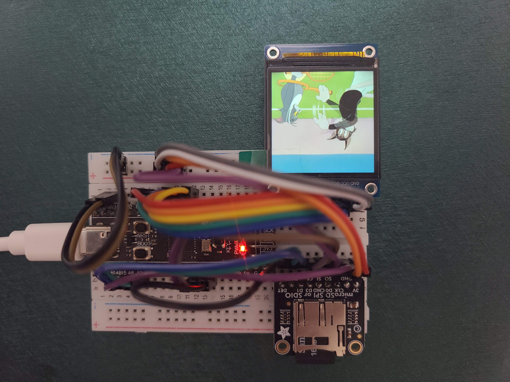

# 개요

microSD카드에 담긴 영상을 ST7789 LCD 모듈에 출력하는 시스템을 구현하는 프로젝트입니다.

## 프로젝트 기간

2026.04.02 ~ 2026.04.26

## 하드웨어 부품
 - STM32F411CEU6(Black-fill)
 - ST LINK V2 MINI 미니 STM8 STM32 다운로더
 - MicroSD 카드 SPI/SDIO 모듈 -3V (Adafruit Micro SD SPI or SDIO Card Breakout Board - 3V ONLY)
 - 샌디스크 MicroSDHC Class4 마이크로SD
 - 1.54 인치 1.54 "풀 컬러 TFT 디스플레이 모듈 HD IPS LCD LED 스크린 Arduino 용 240x240 SPI 인터페이스 ST7789

# 특징

영상은 LCD 모듈의 특징을 따라 출력하기 쉽도록 RGB565 컬러 형식과 240x240 해상도를 가집니다. (일반 영상을 ffmpeg로 형변환함)

V-Model 개발 프로세스를 따라 문서를 먼저 작성 후 개발에 집중했습니다.

# 문서

[VideoPlayer V-model 개발 프로세스 문서](https://docs.google.com/spreadsheets/d/16J_ZiHOk33l3hxcL0F2IagfQToT8IAhKNu-elLCeQOM/edit?pli=1&gid=19350893#gid=19350893)

# 기능 소개

- [main_flowchart.md](docs/main_flowchart.md): `main()` 함수의 전체 제어 흐름을 설명합니다.
- [storage_detection_and_file_access.md](docs/storage_detection_and_file_access.md): microSD 마운트와 RGB565 파일 열기 흐름을 설명합니다.
- [frame_read_and_display.md](docs/frame_read_and_display.md): 프레임 데이터 읽기와 LCD 출력 흐름을 설명합니다.
- [display_range_limitation.md](docs/display_range_limitation.md): LCD 유효 해상도 범위 내 출력 보정 흐름을 설명합니다.
- [automatic_and_loop_playback.md](docs/automatic_and_loop_playback.md): 자동 재생과 반복 재생 구조를 설명합니다.
- [error_handling_and_indication.md](docs/error_handling_and_indication.md): 오류 전환, LED 패턴, 오류 화면 출력을 설명합니다.
- [lcd_module_initialization.md](docs/lcd_module_initialization.md): ST7789 LCD 초기화 절차를 설명합니다.
- [frame_output_quality_assurance.md](docs/frame_output_quality_assurance.md): 프레임레이트 유지와 타이밍 관리 흐름을 설명합니다.
- [resource_constrained_operation.md](docs/resource_constrained_operation.md): 정적 버퍼 기반의 자원 제약 대응 구조를 설명합니다.
- [stable_system_operation.md](docs/stable_system_operation.md): SPI DMA와 SDIO 접근의 충돌 회피 흐름을 설명합니다.

# 시스템 구현 사진

시스템 구현과 관련된 세부 문서는 `docs/` 폴더에 정리되어 있습니다.

# 기타

- git 커밋 메세지 컨벤션은 [Angular Commit Message Guidelines](https://github.com/angular/angular/blob/22b96b9/CONTRIBUTING.md#-commit-message-guidelines)을 따랐습니다.
