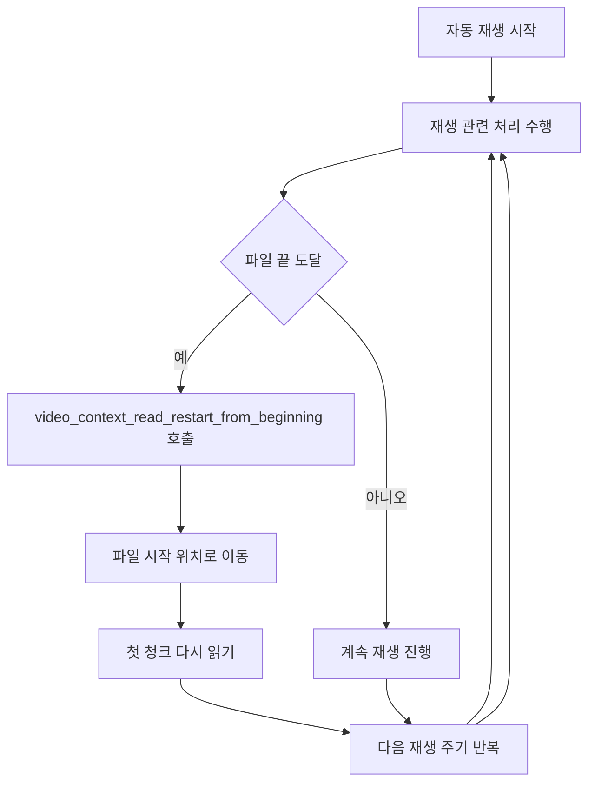

# Automatic and Loop Playback

- 기능 개요: 시스템은 사용자 입력 없이 재생을 진행하고, 파일 끝에 도달하면 처음부터 다시 재생한다.
- 기능 설명: 이 문서는 자동 재생의 세부 처리보다 반복 재생 구조에 초점을 둔다. 상위 호출자는 재생 관련 처리를 한 주기 단위로 반복 수행하며, 파일 끝에 도달하면 `video_context_read_restart_from_beginning()`이 파일 포인터를 처음으로 되돌려 처음부터 다시 재생한다.
- 문서 생성 날짜: 2026-04-27
- 마지막 수정 날짜: 2026-04-27
- 문서 버전: v1.0.0

