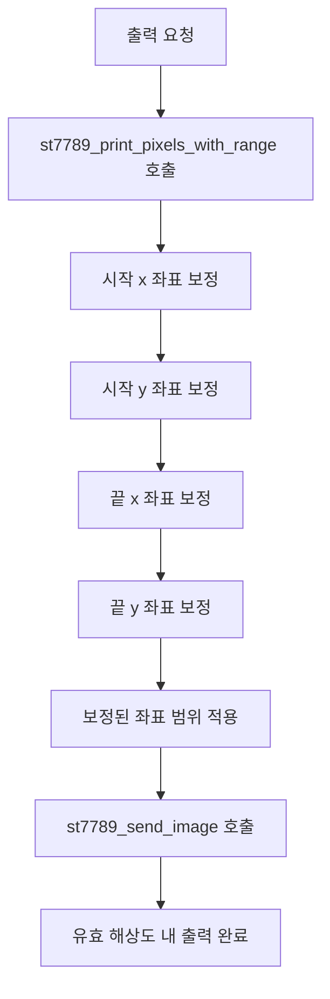

# Display Range Limitation

- 기능 개요: 시스템은 LCD 유효 해상도 240×240 범위 내에서만 영상을 표시한다.
- 기능 설명: 이 기능은 `st7789_print_pixels_with_range()` 내부에서 구현된다. 전달받은 시작/종료 좌표를 `screen_width`, `screen_height` 경계로 보정한 뒤, 보정된 범위만 `st7789_send_image()`로 전송한다.
- 문서 생성 날짜: 2026-04-27
- 마지막 수정 날짜: 2026-04-27
- 문서 버전: v1.0.0

