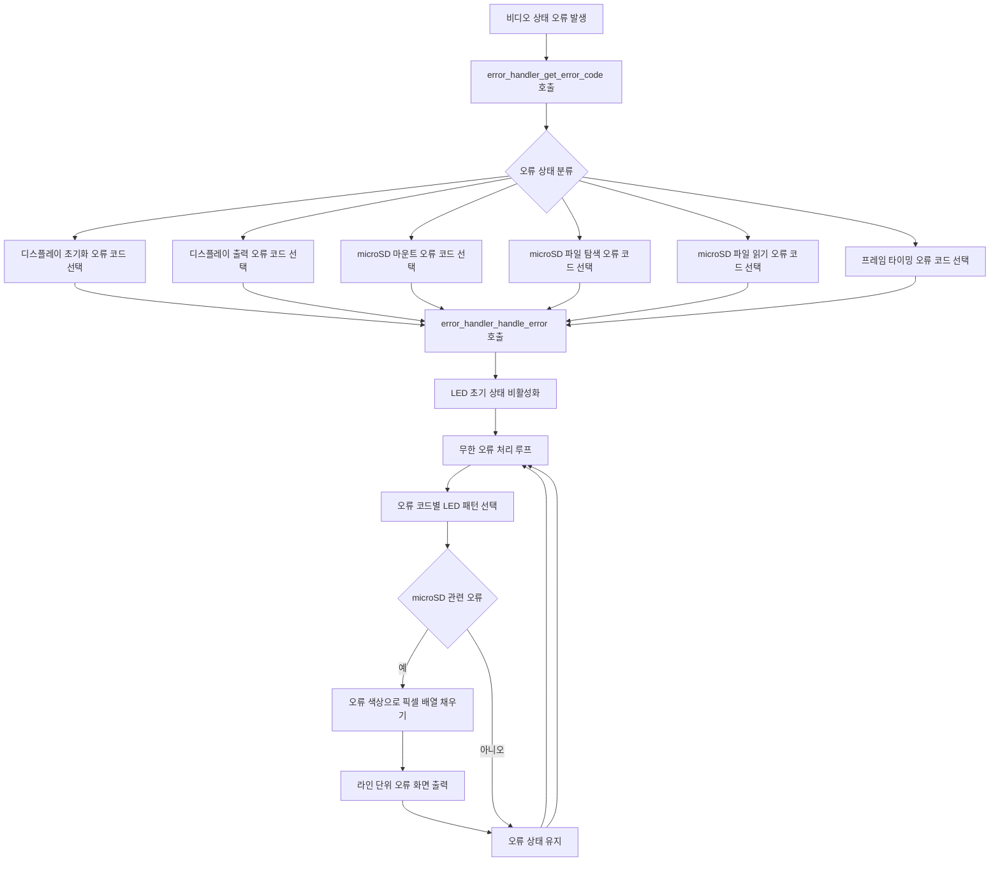

# Error Handling and Indication

- 기능 개요: 시스템은 오류 발생 시 재생을 중단하고 오류 상태로 전환하며, LED 점등 패턴과 오류 화면으로 상태를 표시한다.
- 기능 설명: 이 기능은 `error_handler_get_error_code()`와 `error_handler_handle_error()`로 구현된다. 비디오 계층 상태값을 오류 코드로 변환한 뒤, 무한 루프에서 오류 코드별 LED 패턴을 출력하고 microSD 관련 오류는 LCD에 단색 화면으로도 표시한다.
- 문서 생성 날짜: 2026-04-27
- 마지막 수정 날짜: 2026-04-27
- 문서 버전: v1.0.0

