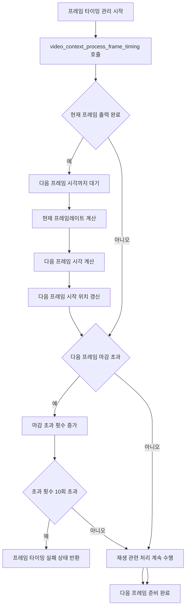

# Frame Output Quality Assurance

- 기능 개요: 시스템은 목표 프레임레이트를 유지하고 프레임 깨짐 또는 누락을 줄이면서 영상을 출력한다.
- 기능 설명: 이 문서는 재생 전체가 아니라 목표 프레임레이트 유지와 타이밍 관리에 초점을 둔다. `video_context_process_frame_timing()`은 현재 프레임의 출력 완료 여부를 확인하고, 다음 프레임 출력 시각을 계산하며, 마감 초과를 누적 관리한다. 실제 파일 읽기와 화면 출력은 별도의 재생 처리 블록으로 압축해 표현한다.
- 문서 생성 날짜: 2026-04-27
- 마지막 수정 날짜: 2026-04-27
- 문서 버전: v1.0.0

