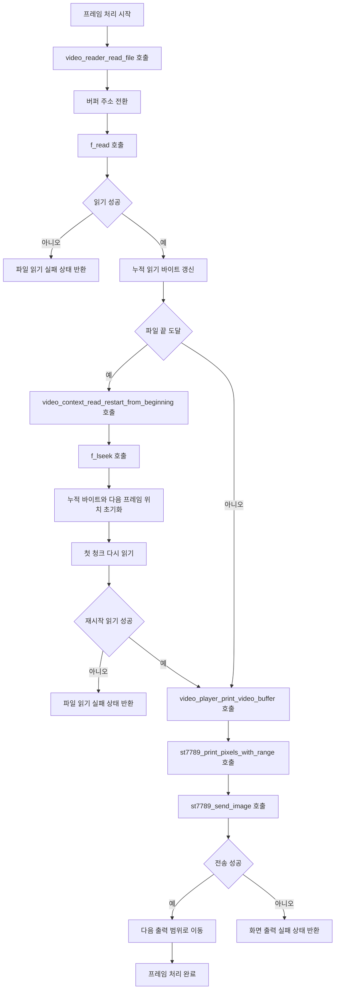

# Frame Read and Display

- 기능 개요: 시스템은 RGB565 파일에서 프레임 데이터를 읽고 LCD에 순차적으로 출력한다.
- 기능 설명: 이 기능은 `video_reader_read_file()`와 `video_player_print_video_buffer()`를 중심으로 구성된다. 파일에서 청크 단위 픽셀 데이터를 읽은 뒤, 현재 출력 범위에 맞춰 ST7789로 전송하고 성공 시 다음 출력 범위로 이동한다.
- 문서 생성 날짜: 2026-04-27
- 마지막 수정 날짜: 2026-04-27
- 문서 버전: v1.0.0

