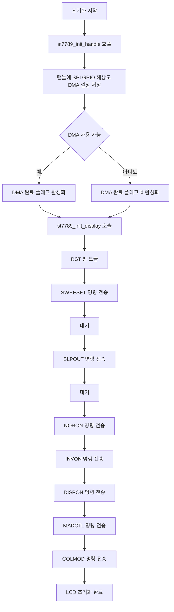

# LCD Module Initialization

- 기능 개요: 시스템은 ST7789 LCD 모듈을 초기화하여 화면 출력이 가능한 상태로 만든다.
- 기능 설명: 이 기능은 `st7789_init_handle()`과 `st7789_init_display()`로 구성된다. 먼저 SPI, GPIO, 해상도, DMA 설정을 핸들에 저장하고, 이후 리셋 신호와 ST7789 명령 시퀀스를 전송하여 디스플레이 동작 모드를 설정한다.
- 문서 생성 날짜: 2026-04-27
- 마지막 수정 날짜: 2026-04-27
- 문서 버전: v1.0.0

