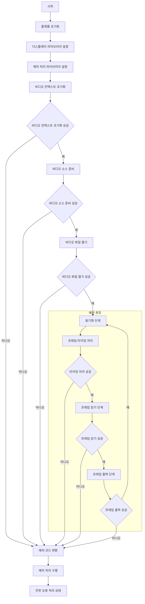

# Main Flowchart

- 기능 개요: `main()` 함수는 시스템 초기화, 비디오 재생 준비, 메인 루프 실행, 오류 처리 전환을 전체적으로 제어한다.
- 기능 설명: 이 문서는 `main.c`의 사용자 작성 코드 흐름을 상위 수준에서 설명한다. HAL 기반 플랫폼 초기화 이후 디스플레이, 오류 처리기, 비디오 컨텍스트를 준비하고, 파일 마운트 및 열기를 마치면 메인 루프에서 동기화, 타이밍 처리, 파일 읽기, 화면 출력을 반복한다. 어느 단계에서든 오류가 발생하면 오류 코드 변환 후 공통 오류 처리 루틴으로 전환한다.
- 문서 생성 날짜: 2026-04-27
- 마지막 수정 날짜: 2026-04-27
- 문서 버전: v1.0.0

