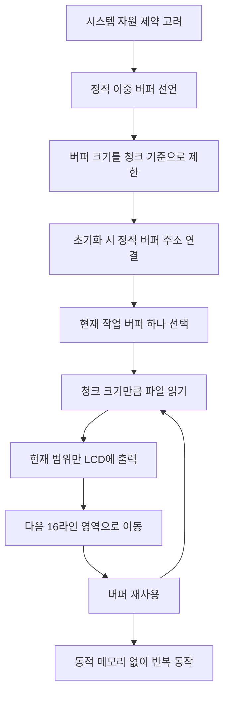

# Resource Constrained Operation

- 기능 개요: 시스템은 STM32F411CEU6의 메모리 및 처리 성능 범위 안에서 동작하도록 구성된다.
- 기능 설명: 이 기능은 `video_context.c`, `video_reader.c`, `video_player.c`에 분산되어 구현된다. 전체 프레임을 동적 할당하지 않고 정적 이중 버퍼를 사용하며, 화면을 여러 청크로 나누어 읽고 출력해 메모리 사용량과 한 번의 전송량을 제한한다.
- 문서 생성 날짜: 2026-04-27
- 마지막 수정 날짜: 2026-04-27
- 문서 버전: v1.0.0

