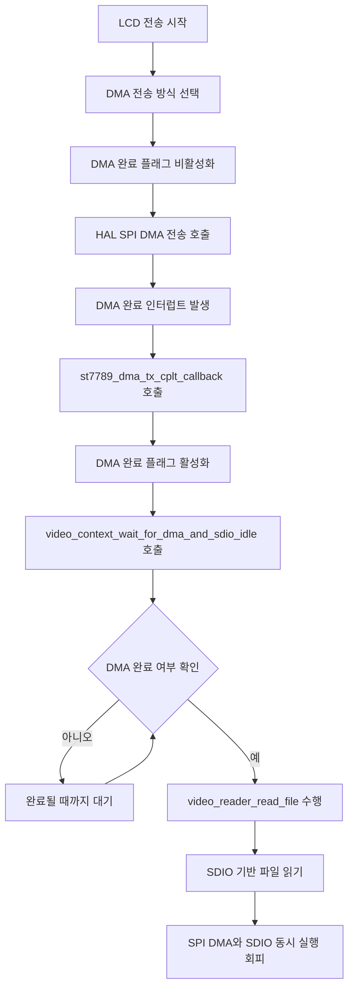

# Stable System Operation

- 기능 개요: 시스템은 SPI DMA 전송과 SDIO 파일 접근의 동시 실행을 피해서 CRC 오류 가능성을 줄인다.
- 기능 설명: 현재 구현은 SDIO를 사용하지 않는 방식이 아니라, ST7789 전송 DMA가 끝날 때까지 기다린 뒤 SDIO 기반 파일 읽기를 진행하는 방식이다. `video_context_wait_for_dma_and_sdio_idle()`와 `st7789_dma_tx_cplt_callback()`이 이 동기화를 담당한다.
- 문서 생성 날짜: 2026-04-27
- 마지막 수정 날짜: 2026-04-27
- 문서 버전: v1.0.0

