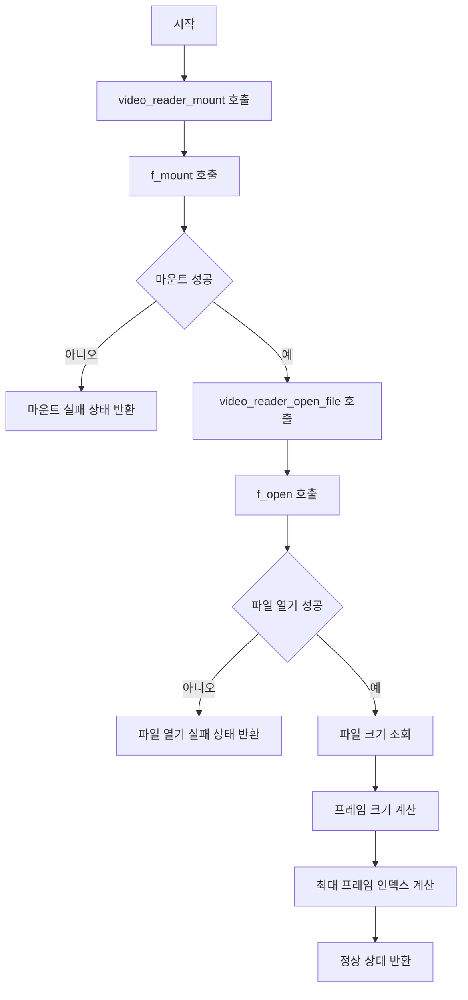

# Storage Detection and File Access

- 기능 개요: 시스템은 microSD 카드를 마운트하고 지정된 RGB565 재생 파일을 열어 읽기 가능한 상태로 준비한다.
- 기능 설명: 이 기능은 `video_reader_mount()`와 `video_reader_open_file()`를 중심으로 동작한다. microSD 파일시스템 마운트가 성공하면 지정된 경로의 재생 파일을 열고, 이후 재생에 필요한 파일 크기와 프레임 크기 메타데이터를 계산한다.
- 문서 생성 날짜: 2026-04-27
- 마지막 수정 날짜: 2026-04-27
- 문서 버전: v1.0.0

